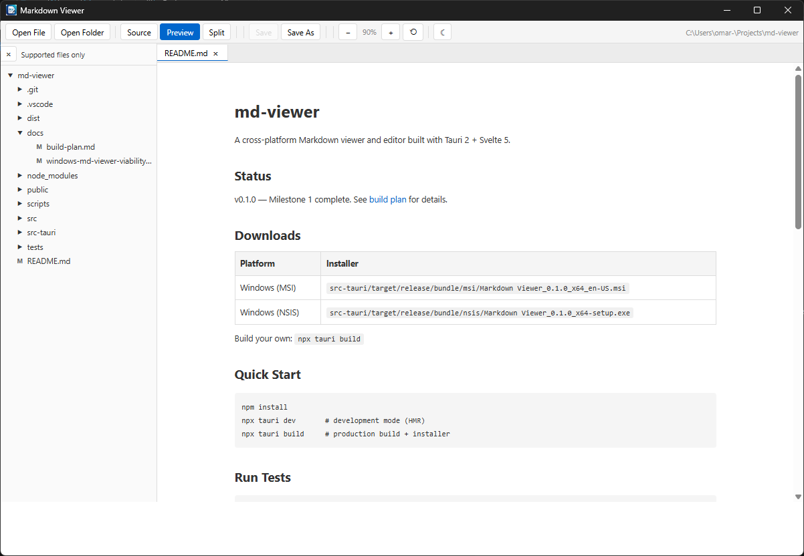

# md-viewer

A cross-platform Markdown viewer and editor built with Tauri 2 + Svelte 5.



## File Type Association

On install, md-viewer registers as the default handler for these extensions, so opening them from File Explorer opens directly in the app:

| Type | Extensions | MIME |
|---|---|---|
| Markdown | `.md`, `.markdown`, `.mdown` | `text/markdown` |
| Plain text | `.txt`, `.text`, `.log` | `text/plain` |

The "Supported files only" toggle in the file tree hides unsupported extensions by default for cleaner navigation.

## Downloads

| Platform | Installer |
|---|---|
| Windows (MSI) | `src-tauri/target/release/bundle/msi/Markdown Viewer_0.1.0_x64_en-US.msi` |
| Windows (NSIS) | `src-tauri/target/release/bundle/nsis/Markdown Viewer_0.1.0_x64-setup.exe` |

Build your own: `npx tauri build`

## Quick Start

```bash
npm install
npx tauri dev       # development mode (HMR)
npx tauri build     # production build + installer
```

## Run Tests

```bash
npm test            # unit tests (Vitest)
npm run test:e2e    # E2E tests (Playwright)
```

## Features

- **View modes**: Preview (default), Source, and Split (side-by-side)
- **Live preview**: Debounced Markdown rendering with DOMPurify sanitization
- **Tabbed editing**: Multiple files open simultaneously
- **File tree**: Lazy-loading folder explorer with supported-files filter
- **Dark mode**: Toggle in the toolbar (persisted)
- **Zoom**: Ctrl+± to scale the UI, Ctrl+0 to reset (persisted)
- **State persistence**: Open tabs, folder, view modes, zoom, and theme restored on restart
- **OS file associations**: Registers for `.md`, `.markdown`, `.mdown`, `.txt`, `.text`, `.log`

## Performance Design

md-viewer is designed around lazy evaluation to handle large repositories and files efficiently:

- **Lazy file tree** — directories load children only on expand, not upfront. No recursive pre-scan.
- **Debounced preview** — markdown rendering debounced at 150ms to avoid re-rendering on every keystroke.
- **Large file guardrails** — files >2MB show a warning banner and skip live preview to keep the UI responsive.
- **Parallel startup** — restored tabs are re-read concurrently via `Promise.all`, not sequentially.
- **Render cache** — unchanged content skips markdown-it re-parsing (compared by length + prefix hash).
- **No content indexing** — filename search only; no background parsing of unopened files.
- **Mounted editors** — only the active tab keeps a live CodeMirror instance; inactive tabs store a snapshot.
- **Rust backend** — file I/O stays in the Rust layer with narrow permissions; no JS-side filesystem access.

## Tech Stack

| Layer | Choice |
|---|---|
| Desktop shell | Tauri 2 |
| Frontend | Svelte 5 (runes) |
| Editor | CodeMirror 6 |
| Markdown | markdown-it + DOMPurify |
| Backend | Rust |
| Testing | Vitest + Playwright |

## Project Structure

```
src/              Svelte frontend
  lib/
    components/   UI components
    stores/       Svelte runes state (tabs, fileTree, settings, theme)
    utils/        markdown, debounce, file utils, persistence
src-tauri/        Rust backend
  src/
    commands.rs   IPC commands (read/write/list_dir)
    lib.rs        Tauri app bootstrap
tests/
  unit/           Vitest tests
  e2e/            Playwright tests
```

## Icon

To replace the app icon with your own:
```
node scripts/process-icon.mjs   # trims white border
npx tauri icon src-tauri/icons/icon-processed.png
```
